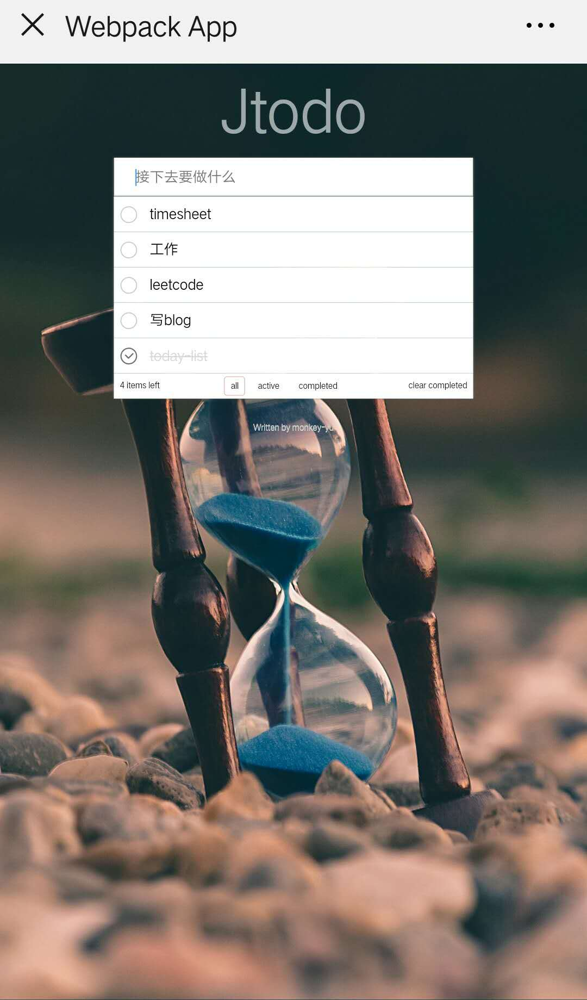

# vue-webpack-jtodo
该项目是基于慕课网上的一个vue +webpack 从0搭建的todo list 项目。主要学习webpack 的配置以及vue 的基础核心知识。

项目示例:

web端展示

H5端展示：

#### 路径：

1. 新建文件夹vue-webpack-todo.

2. npm init 初始化该项目为一个npm 的项目。会产生package.json文件。

3. npm install webpack vue vue-loader,不区分dependencies 和 devdependencies.

4. 缺少其它依赖，再安装。

5. 新建src 文件夹放源码。在其中新建app.vue 文件。

6. 新建webpack.config.js ,准备配置该文件。

7. 配置：entry 、output、

8. 在src下新建一个index.js文件，作为入口文件。在该文件中引入app.vue。new Vue()组件并挂载到一个root节点上。通过document.createElement('div')创建一个root 节点。

9. 在package.json文件中scripts中加入 build任务"webpack --config webpack.config.js"。

10. webpack.config.js文件中继续配置loader.

11. npm run build 尝试下压缩打包下。

12. 继续配置.vue ，.css以及图片等文件的loader。并安装相关loader.

13. 在package.json文件中scripts中加入 dev任务"webpack-dev-server webpack --config webpack.config.js"。要安装webpack-dev-server 

14. npm i cross-env .来写build 和dev 的脚本。例如："build": "cross-env NODE_ENV=production webpack --config webpack.config.js"

15. 在webpack中通过isDev变量判断来添加一些开发环境下的配置，比如热更新，还有在devServer中，配置port、host 、open 等。

16. 添加plugins。

17. 开始todo项目开发。

> 已完结 

